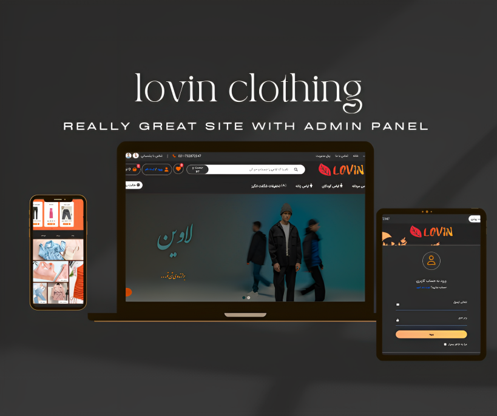
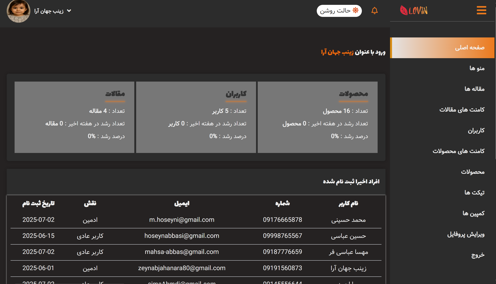

#  Lovin Clothing
<p align="center">
  
</p>
Lovin Clothing is a full-stack **online clothing store** built with **Node.js, Express, MongoDB, and Vanilla JavaScript**.  
It includes a **user storefront** and an **admin panel** for product and category management.

---

##  Features
- 🧍 User authentication (Register, Login, JWT)
- 👗 Browse products by category
- ❤️ Add / remove favorites
- 🛒 Add to cart / calculate total of price and discounts
- 💬 Product comments & ratings
- 💬 articles comments & ratings
- 🧱 Admin panel for managing products, users, and discounts
- 💡 Responsive UI with global page loader

---
## 🔑 Admin Access
To access the admin panel, create an admin user directly in MongoDB with role: "admin".
<p align="center">
  
</p>
## Tech Stack

**Frontend:** HTML, CSS, JS, Bootstrap  
**Backend:** Node.js, Express.js, MongoDB (Mongoose)  
**Auth:** JWT + bcrypt

---

## 🌐 Live Demo
[View Online](https://lovin-clothing.onrender.com)


## 📁 Project Structure


(مثل ساختار پوشه‌ها و فایل‌ها: frontend، backend، models، controllers، routes و ...)

Environment Variables
توضیح بده چه .env هایی باید تنظیم بشن:

## ⚙️ Environment Variables
Create a `.env` file in the backend directory with the following:

MONGO_URI=your_mongodb_connection_string
JWT_SECRET=your_secret_key
PORT=5000

##  Setup

```bash
git clone https://github.com/your-username/lovin-clothing.git
cd lovin-clothing/backend
npm install
npm run dev
